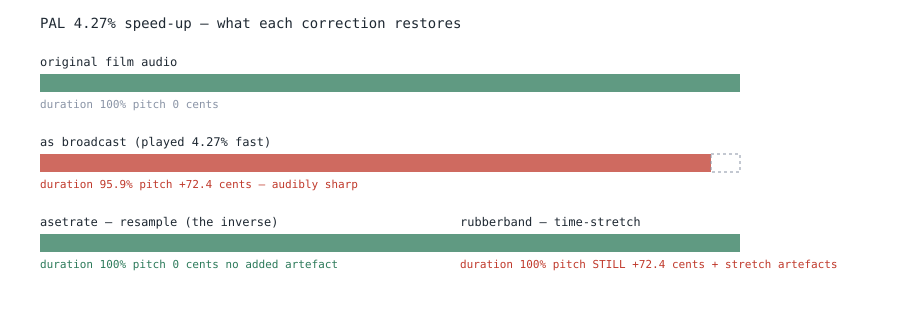

# Audio speed correction — which method, and why

**Decision: use `asetrate` (resample) for PAL and for NTSC. Do not use
`rubberband` or `atempo` for either.** Recorded 2026-09-01, owner's ruling.

This document exists because the reasoning is not obvious from the measurements
alone, and the *right* answer inverts under a condition nothing currently
detects. Anyone changing this must read the inverting case first.

---

## The two speed relations

| relation | factor | pitch shift | audible? |
| :--- | ---: | ---: | :--- |
| PAL, 25 / 23.976 | 1.042709 | **+72.4 cents** | yes — about ¾ of a semitone |
| NTSC, 1000 / 999 | 1.001001 | +1.7 cents | no |

---

## Why `asetrate`, and it is not because it scores better

**PAL speed-up is normally a naive speed change.** 24 fps film is run at 25 fps,
so the audio plays 4.27% fast **and its pitch rises with it**. Industry practice
is to leave it that way: pitch-correcting on the way in adds its own artefacts,
so most studios do not.

- **`asetrate` is the exact inverse of that operation.** It restores duration
  **and** the original pitch, and introduces no artefact of its own, because it is
  the same transformation run backwards.
- **`rubberband` restores the duration and leaves the pitch 72.4 cents sharp,
  permanently**, while adding stretch artefacts. **It preserves the defect it was
  asked to remove.**

**So the fidelity numbers and the listening answer agree, for the same underlying
reason.** Measured:

| method | PAL, 72.4 cents | NTSC, 1.7 cents |
| :--- | :--- | :--- |
| `asetrate` | wins 23 of 23 | wins 6 of 6, median **0.9997** |
| `rubberband` | loses | median 0.8553 |

**And rubberband's cost does not scale down with the stretch.** At 72.4 cents its
residual matched its pitch-only penalty to 0.0014; at 1.7 cents it is **0.12
worse** than the penalty. A 0.1% correction pays nearly what a 4.3% one does.

**A passthrough control does not test this.** A `tempo=1:pitch=1` arm reading
1.0000 shows rubberband is clean when it does **nothing** — not that it is clean
when it works.

---

## THE INVERTING CASE — read this before changing anything

**If the source was already pitch-corrected at its origin, every conclusion above
reverses.** Its pitch is then correct and only its duration is wrong, so
`asetrate` would drag the pitch **72.4 cents flat** and a time-stretch would be
the right repair.

**Nothing currently detects this**, and on such a file the policy above would
silently make the audio worse.

**What we know**: the naive model holds across everything measured so far — of
twelve files compared against real masters, **16 of 16 tracks read
`same_recording` after `asetrate` correction.** Had they been pitch-corrected at
source, that correction would have made them worse rather than better.

**What we do not know**: whether an inverting case exists in this corpus at all.

### The detector, and its two known weaknesses

The discriminator is empirical rather than a new pitch estimator: **apply both
corrections and fingerprint each against the master; the one that scores higher
names the transformation the source underwent.** **The sign flips between the two
cases, so the sign is the detector.**

**MEASURED against real masters** — these supersede an earlier projection:

| file | uncorrected | `asetrate` correct direction | `asetrate` wrong direction | `rubberband` |
| :--- | ---: | ---: | ---: | ---: |
| A | 0.5621 | **0.9800** | 0.5469 | 0.6666 |
| B | 0.5612 | **0.9636** | 0.5362 | 0.6633 |
| C | 0.5580 | **0.9421** | 0.5474 | 0.6644 |

**Measured margin in the naive case: 0.278–0.313, not the 0.420 projected.** The
projection assumed `asetrate` reaches 1.000; **against a real master it reaches
0.94–0.98, because real pairs carry content and codec differences no correction
removes.** A threshold taken from the projection would have been ~35% too wide.
**Every threshold must come from measured spread, not from a curve.**

Two corroborations fall out of the same table: the `rubberband` column reads
0.6633–0.6666 against **0.6707** obtained independently on different files by a
different harness; and the uncorrected column reads **0.558–0.562**, which
measures the floor that the section below argues for on geometry alone.

**Weakness 1 — it is biased against the case it exists to find.** `rubberband`
pays its ~0.109 processing handicap **even when it is the correct tool**, which
eats half its margin. **The detector is twice as sensitive to what we already
believe as to what it exists to find.** Consequence: **the threshold cannot be
zero.** A band must read **UNDECIDED** and fall through to the default rather than
pick a winner out of noise.

**Weakness 2 — it assumes the master is not itself a transfer.** The comparison is
against the master, so **if both files were PAL-transferred their pitches agree**
and the discriminator reads a confident match on the wrong arm. The database is
the only authority on which file is the master; **where that authority is absent
the detector must DECLINE, not assume.**

### THE DETECTOR MUST HAVE THREE OUTCOMES AND A DECLINE, NOT TWO

**Measured across 33 PAL-shaped files of 314 resolvable, three arms, real
masters:**

| verdict | files | |
| :--- | ---: | :--- |
| `asetrate` | 9 | naive PAL — the ruling holds, margin +0.267 to +0.313 |
| `rubberband` | 1 | **the inverting case exists** |
| **LEAVE IT ALONE** | 2 | already matching; needs no correction |
| decline | 21 | no arm matches anything |

**The match bar is taken from the data, not guessed**: in the unambiguous group
`asetrate` reads **0.937–0.980** and nothing else in the corpus reaches that, so
0.85 is the bar. Under it, **17 of the 33 apparent "wins" are orderings among
failures** — margins of 0.004–0.077 with every arm at the floor. **A verdict read
off those would be noise wearing a decision's clothes.**

**The two leave-alone files are why two outcomes are unsafe:**

| | uncorrected | `asetrate` | `rubberband` |
| :--- | ---: | ---: | ---: |
| one | **0.9409** | 0.5523 | 0.5931 |
| other | **0.9220** | 0.5508 | 0.5920 |

**A 4.5% rate difference cannot leave audio matching at 0.94 across 240 s.** Their
duration difference is **extra content — a longer tail — and the pair already runs
at one rate.** A two-outcome detector must pick a transformation, **so it would
take a 0.94 match down to 0.55 and call that a decision.**

**The asymmetry of harms decides the design.** Missing the inverting case leaves a
track 72.4 cents flat. **Correcting an incidental ratio destroys a track that
needed nothing** — and here **the destructive case is twice as common as the one
the detector exists to catch.**

### A control that cannot fail is not a control

The first design asked for a file where `asetrate` correction leaves fidelity
**worse than no correction**. That test cannot fire. *No correction* means
comparing across a 4.27% speed difference — over a 240 s window the signals drift
**10.3 s apart, 82 Chromaprint frames**, so they diverge across the window and no
single shift aligns them. **The uncorrected reading is pinned near the 0.5 floor
by geometry alone, and against a floor almost any correction is an improvement.**

The run would have reported *"the inverting case is not present in this corpus"*
**without ever being able to report anything else** — true by construction, and a
statement about the instrument rather than about the corpus.

**The uncorrected arm is kept as a diagnostic, so the floor is shown rather than
asserted.** It has since been measured at **0.558–0.562**, confirming the
geometric argument. The decisive comparison is between the two arms that both
restore duration and are therefore both alignable.

### Weakness 3 — the correction has a DIRECTION, and getting it wrong is invisible

`r` = master / candidate = 1.0427. **The candidate runs FAST and must be SLOWED**:
`asetrate = 48000 / r`. A sweep applied `48000 * r`, **speeding it up further and
landing twice as wrong**, while the `rubberband` arm carried the correct
direction.

**The result was rubberband winning 33 of 33 files** — consistent sign, no
outliers, plausible magnitudes. At face value, a corpus-wide refutation of this
policy. **Nothing internal to the run could have caught it.**

What caught it was that three of the thirty-three overlapped a set someone else
had verified by another route. **The table disagreed with a result the author had
not produced.** Had those sets not overlapped, there was no check at all.

**So: any sweep of a directional correction must carry the wrong direction as its
own column** — as the table above does — so a sign error reads as the floor
instead of as a finding.

---

## Caveats, stated rather than buried

- The comparison used **`rubberband` at default settings.** Better settings might
  narrow the 0.12 gap. **They cannot fix a pitch that is wrong by construction.**
- At **1.7 cents the pitch error is inaudible either way**, so for NTSC the choice
  rests on fidelity alone — where `asetrate` still wins 6 of 6.
- The NTSC comparison did **not** measure those six against their masters. They
  carry 174–190 s of content difference against a relation explaining 2.7–3.7 s,
  so that comparison would have been **dominated by content while looking like a
  pitch answer.** The transfer was simulated on real audio from the same files,
  where ground truth is exact.
- **A resampled track must be tagged.** The owner's standing instruction: if you
  resample an audio track, mark it as resampled.

---

## Sources

- [Doom9 — Film to PAL speedup audio pitch/tempo quality](https://forum.doom9.org/archive/index.php/t-131677.html)
- [VideoHelp — Capturing and correcting PAL-speed audio of 24fps film without artefacts](https://forum.videohelp.com/threads/383845-Capturing-and-correcting-PAL-speed-audio-of-24fps-film-without-artefacts)
- [Wikipedia — Audio time stretching and pitch scaling](https://en.wikipedia.org/wiki/Audio_time_stretching_and_pitch_scaling)
